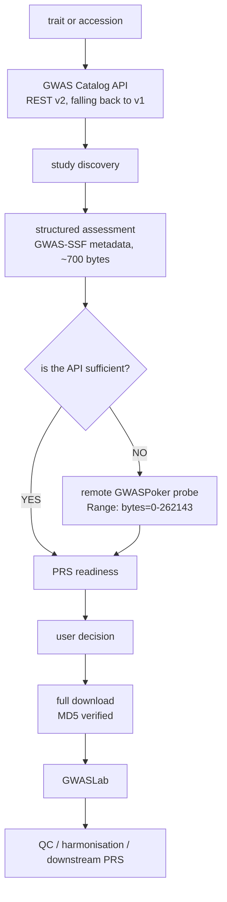

# GWASPoker

API-aware pre-download triage of GWAS summary statistics for PRS workflows.

[](https://github.com/MuhammadMuneeb007/GWASPokerforPRS2/actions/workflows/ci.yml)
[](https://www.python.org/)
[](LICENSE)

---

## The problem

A polygenic risk score needs summary statistics with the right columns: a
variant identifier, both alleles, an effect size and a p-value. Whether a given
file has them is not recorded anywhere you can query. So the usual workflow is:

1. find candidate studies for your phenotype;
2. download one — often 300 MB to 3 GB;
3. decompress it;
4. look at the header;
5. discover it lacks the other allele, and start again.

Steps 2 and 3 cost gigabytes and minutes each time, and you repeat them for
every candidate. Scanning the GWAS Catalog reveals many files per phenotype,
differing in population, sample size, genome build, analysis type and — the part
that decides usability — which columns they actually contain.

## What GWASPoker does

It answers step 4 before step 2.

For a file declaring conformance to
[GWAS-SSF v1.0](https://github.com/EBISPOT/gwas-summary-statistics-standard),
the mandatory column set is fixed by the standard, so a **700-byte metadata
file** settles it and no data is transferred at all.

For everything else, GWASPoker requests the **first 256 KB** with an HTTP Range
request, inflates that prefix incrementally, finds the header, maps the columns
to a canonical vocabulary, and returns a verdict.

Measured on a real study, `GCST90038646` (the numbers below come from the run
transcript, not an estimate):

| | |
| --- | --- |
| Remote file | 377.78 MB |
| Bytes inspected | 256.00 KB |
| Transfer avoided | **99.93%** |
| Time | ~2 s |
| Result | full 24-column header recovered, `READY` for PRS |

And on `GCST90271311`, which declares GWAS-SSF v1.0:

| | |
| --- | --- |
| Remote file | 316.00 MB |
| Bytes inspected | **0** |
| Result | `READY` — raw file probing was unnecessary |

## What GWASPoker is not

It is a **decision layer**, not a replacement for anything. It does not
reimplement, and is not a substitute for:

* **GWAS-SSF** — it *reads* the standard's metadata; it does not redefine it
* **the GWAS Catalog REST API** — it is a client
* **the GWAS Catalog Summary Statistics API** — see [Limitations](#limitations)
* **GWASLab** — it hands files *to* GWASLab
* **MungeSumstats**, **PRSice**, **PLINK**, **LDpred2** — all downstream

GWASPoker tells you which file to give those tools. It does no QC, no
harmonisation, no liftover and no scoring.

> GWASPoker uses structured GWAS Catalog information first. Remote file probing
> is performed only when file-level inspection is required or explicitly
> requested.

---

## Architecture



The decision layer is the boxes between `study discovery` and `user decision`.
Everything below `full download` is other people's software.

See [`docs/ARCHITECTURE.md`](docs/ARCHITECTURE.md) for module layout and
[`docs/API_SOURCES.md`](docs/API_SOURCES.md) for every upstream interface.

---

## Installation

```bash
git clone https://github.com/MuhammadMuneeb007/GWASPokerforPRS2.git
cd GWASPokerforPRS2
pip install -e .
```

Requires Python 3.9 or later. Runs on Windows, Linux and macOS — no shell tools,
no `wget`, no HPC environment.

Optional extras:

```bash
pip install -e ".[llm]"      # ELECTRA fallback for sample-size extraction
pip install -e ".[gwaslab]"  # downstream harmonisation
pip install -e ".[excel]"    # .xlsx summary statistics
pip install -e ".[dev]"      # pytest, ruff, black
pip install -e ".[all]"      # everything
```

Conda:

```bash
conda env create -f environment.yml
conda activate gwaspoker
pip install -e .
```

`python -m gwaspoker` works identically to the `gwaspoker` command.

---

## Quick start

```bash
gwaspoker search --trait migraine --population European
gwaspoker probe GCST90038646
gwaspoker assess GCST90038646 --target prs
gwaspoker download GCST90038646
gwaspoker scan downloaded_file.tsv.gz
```

---

## Inputs: accession, URL, or local file

Every target-taking command accepts the same three forms. There is no separate
`assess-url` command.

```bash
gwaspoker assess GCST90271311                                  # GWAS Catalog accession
gwaspoker assess https://some-consortium.org/gwas.txt.gz       # direct URL
gwaspoker scan   ./downloaded.tsv.gz                           # local file (scan only)
```

**Everything after the file is located is identical.** A direct URL skips the
GWAS Catalog resolver; it does not skip, shorten or weaken the analysis:

```text
accession  ─┐
direct URL ─┼─→ bounded probe → compression → header → mapping
local file ─┘                 → value validation → PRS readiness → output
```

A direct URL is still **bounded**: it never triggers a full download.
`--probe-bytes` is the ceiling either way.

```bash
gwaspoker assess https://example.org/huge.gz --probe-bytes 262144
```

### URL rewrites are explicit, and never guesses

`requests` has no FTP adapter, so `ftp://` has to become `https://` to be
fetchable. GWASPoker does that **only for hosts verified to serve the same
paths over both** — `ftp.ebi.ac.uk`, `ftp.ncbi.nlm.nih.gov`, `ftp.sanger.ac.uk`
and `ftp.1000genomes.ebi.ac.uk`. For any other host the URL is refused with an
explanation, because `ftp://host/path` does not imply that `https://host/path`
exists: guessing turns "unsupported scheme" into a misleading 404 against a URL
you never asked for.

Known share links are rewritten too. A Dropbox URL ending `.zip` returns an
HTML preview page, not the file, unless `dl=1` is set — which GWASPoker used to
report as a ZIP decompression error. Only Dropbox is implemented, because it is
the only provider there is evidence for; rewrite rules for hosts with no
failing examples would be speculative and untestable.

Every rewrite is reported. `normalisation_rule` names the rule that fired and
`original_url` preserves what you typed, so a supplementary table can state
exactly which URLs were altered and why.

### When the server returns a page instead of a file

A URL ending `.gz` that responds with HTML is not a corrupt archive. GWASPoker
classifies the payload before trying to decode it and reports
`non_data_response` — with the final URL after redirects and the content-type —
rather than `decompression_error`. A `.gz` that turns out to be plain text is
`content_mismatch`, and is read as the plain text it is.

### The source type is recorded

Reports and provenance carry `input_type`, so an external-validation experiment
can separate catalogue studies from arbitrary public URLs without re-parsing
the target string:

```json
{ "input_type": "direct_url",
  "input": { "input": "https://www.dropbox.com/s/abc/gwas.txt.gz?dl=0",
             "original_url": "https://www.dropbox.com/s/abc/gwas.txt.gz?dl=0",
             "url": "https://www.dropbox.com/s/abc/gwas.txt.gz?dl=1",
             "normalisation_rule": "dropbox_direct_download",
             "accession": null } }
```

```json
{ "input_type": "gwas_catalog_accession",
  "input": { "input": "GCST90271311",
             "accession": "GCST90271311",
             "url": null } }
```

Note what differs between the two routes on the *same* file: an accession can
reach a verdict through the GWAS-SSF sidecar with **zero data bytes**, while a
direct URL has no catalogue metadata and is probed. Both reach `READY`; the
`readiness_evidence_source` field records which route produced it.

Classification lives in one module, `inputs.py`, and a test prevents any
command from reimplementing it.

---

## `gwaspoker search`

```bash
gwaspoker search --trait migraine
gwaspoker search --trait migraine --population European --sumstats-only
gwaspoker search --trait "coronary artery disease" --limit 50
```

```text
Retrieved 6 study/studies.
Excluded 4 matching 'Gene-based burden' (pass --no-default-excludes to keep them).

GWAS Catalog studies for migraine in European
GCST          Trait                  Population        N   Cases  Controls  File  SSF Meta  Harmonised  GWAS-SSF   PRS   Probe  Year      PMID
GCST90473326  ICD10 G43: Migraine    European    458,440  25,393   433,047  yes     yes        yes        yes     READY   no   2025  40770095
GCST90079826  ICD10 G43.9: Migraine  European    387,898   3,383   384,515  yes     yes        yes         no       ?     yes  2021  34662886
GCST90079827  ICD10 G43: Migraine    European    378,172   8,426   369,746  yes     yes        yes         no       ?     yes  2021  34662886
GCST90671940  Migraine               European    341,050  10,881   330,169  yes     yes         no        yes     READY   no   2022  35115687
GCST90077745  Migraine               European    331,754  14,131   317,623  yes     yes        yes         no       ?     yes  2021  34662886
```

Six columns say what it will take to actually use each study:

| Column | Means |
| --- | --- |
| **File** | A summary-statistics data file is published |
| **SSF Meta** | The GWAS-SSF `-meta.yaml` sidecar is retrievable. This is a **static metadata file served over HTTP, not an API** |
| **Harmonised** | A `harmonised/` product is published alongside the raw submission |
| **GWAS-SSF** | The file *declares* conformance to GWAS-SSF v1.0, so its mandatory column set is guaranteed |
| **PRS** | The readiness verdict derivable from that declaration alone |
| **Probe** | Whether bytes must be read from the data file to reach a verdict |

Read the first row: `GCST90473326` declares GWAS-SSF, so **PRS is READY and no
probe is required** — `gwaspoker assess` will return a verdict having
transferred no data at all. Row two has a perfectly readable sidecar
(`SSF Meta = yes`) but declares `pre-GWAS-SSF`, so nothing is guaranteed about
its columns and a probe *is* required.

That distinction matters: **a retrievable sidecar does not mean the probe can be
skipped.** Only a GWAS-SSF declaration settles it. `PRS = READY` exactly when
`GWAS-SSF = yes`, and `Probe` is its inverse — the columns are shown separately
because they answer the two questions a user actually asks.

Every value is `yes`, `no`, or `?`. `?` means the fact could not be established,
which is **not** the same as `no`: a network timeout leaves the columns `?` and
records a failure category, never a fabricated negative.

Studies whose reported trait contains "Gene-based burden" are excluded by
default — they aggregate variants to a gene, so they are not variant-level
summary statistics and cannot yield PRS weights at all (the Catalog labels them
`file_type: non-GWAS-SSF`). The count excluded is always printed.

```bash
gwaspoker search --trait migraine --no-default-excludes    # keep them
gwaspoker search --trait migraine --exclude "time to event" --exclude "MTAG"
```

### Cost

These columns need two or three requests per study — a directory listing, often
a second listing for `harmonised/`, and the sidecar fetch. The stage runs on a
thread pool; measured on 24 studies:

| Workers | Elapsed | Per study |
| --- | --- | --- |
| 1 | 22.8 s | 0.95 s |
| 6 (default) | **9.7 s** | 0.41 s |
| 10 | 9.0 s | 0.37 s |

The speedup flattens after ~6 workers because the process-wide rate limiter
(8 requests/second by default) becomes the binding constraint, not latency.
Concurrency overlaps waiting; it does not raise the request rate. For 300
studies expect roughly two minutes.

```bash
gwaspoker search --trait migraine --workers 8
gwaspoker search --trait migraine --no-check-files   # skip the stage entirely
```

---

## `gwaspoker probe`

```bash
gwaspoker probe GCST90038646
gwaspoker probe https://example.org/study.tsv.gz
gwaspoker probe GCST90038646 --probe-bytes 65536
gwaspoker probe GCST90038646 --harmonised no
```

```text
Study: GCST90038646 — Migraine
File: 33959723-GCST90038646-EFO_0003821.h.tsv.gz
Selected because: fully harmonised file (.h.tsv); in harmonised/ and harmonised
output was requested; compressed tabular text; filename carries the study
accession; size used only as a tiebreaker (scored 16.43 against 2 others)

Format            TSV.GZIP
Remote size       377.78 MB
Bytes inspected   256.00 KB
Transfer avoided  99.9338%
Range requests    used
Transfer time     2.00 s
Encoding          utf-8 (100% confidence)
Decompressed      959.53 KB (3.7x expansion)

Detected header (row 0, tab-separated, 72% confidence)
  hm_variant_id  hm_rsid  hm_chrom  hm_pos  hm_other_allele  hm_effect_allele
  hm_beta  hm_odds_ratio  ...  beta  standard_error  p_value  odds_ratio

                    Canonical column mapping
  #  Column                Canonical concept        PRS   Method     Conf.
  0  hm_variant_id         variant_id               SNP   alias       0.95
  2  hm_chrom              chromosome               CHR   alias       0.95
 11  hm_code               unknown                        unknown        —
 18  beta                  beta                     BETA  canonical   1.00
```

The bound is on **bytes**, not time. Where the server honours
`Range: bytes=0-N` GWASPoker uses it; where it does not, the stream is closed
locally at the limit. Recorded either way: `requested_bytes`, `received_bytes`,
`remote_file_size`, `range_supported`, `range_used`, `transfer_time`.

Sizes: `--probe-bytes 65536 | 131072 | 262144 | 524288 | 1048576`. The default
is 262144 (256 KB), chosen as a starting point — see
[Benchmarking](#benchmarking).

File selection is by naming convention, never by size. `.h.tsv.gz` (fully
harmonised) outranks `.f.tsv.gz` (format-harmonised) outranks the raw file when
`--harmonised auto`; size only breaks ties. Every choice records why.

---

## `gwaspoker assess`

```bash
gwaspoker assess GCST90038646 --target prs
gwaspoker assess GCST90038646 --target prs --force-probe
gwaspoker assess GCST1 GCST2 GCST3 --output prs_assessment.csv --format csv
```

**Structured route sufficient** — 316 MB file, zero data bytes:

```text
Study: GCST90271311
Trait: Platelet count
API assessment: sufficient — no data bytes needed
Declared format: GWAS-SSF v1.0 (genome build GRCh38, harmonised=False)
Remote file: GCST90271311.tsv.gz (raw)
Remote size: 316.00 MB
Bytes inspected: 0 — raw file probing was unnecessary

PRS readiness: READY
Evidence: gwas_ssf_metadata (GWAS-SSF v1.0)

Required fields:
  ✓ variant identification <- chromosome, base_pair_location
  ✓ effect allele <- effect_allele
  ✓ other allele <- other_allele
  ✓ effect size <- beta
  ✓ p-value <- p_value

Recommended:
  ✓ standard error <- standard_error
  ✗ sample size (per-variant N; some methods accept a study-level N instead)
  ✓ allele frequency <- effect_allele_frequency
  ✗ imputation quality (INFO)

Decision:
  Suitable for downstream PRS preparation. Note that sample size, imputation
  quality (INFO) are absent, which rules out methods that need them.
  Assessed from the file's declared GWAS-SSF conformance; the data file was not read.
```

**Structured route insufficient** — the file is `pre-GWAS-SSF`, so the probe
runs and `Evidence:` becomes `file_probe`.

Workflow:

```text
1. Query official study metadata          (v2, falling back to v1)
2. Resolve the summary-statistics file    (naming convention)
3. Check the GWAS-SSF metadata sidecar    (~700 bytes)
4. Sufficient?  -> return the verdict, and say probing was unnecessary
5. Insufficient -> probe the remote file  (<= --probe-bytes)
6. Return the final PRS assessment
```

`--force-probe` runs both routes on the same study and reports any
disagreement. That comparison is the basis of the scientific evaluation, and it
is why the flag exists.

`--no-api` skips the structured route entirely.

Verdicts are `READY`, `PARTIAL`, `NOT_READY` or `UNKNOWN`. The exact rules are
in [`docs/MAPPING_SCHEMA.md`](docs/MAPPING_SCHEMA.md) and in
`readiness/prs.py`, stated once as data.

---

### Value-domain validation

The header proposes a concept; the sampled values test it. A column headed
`CHR` whose values are `1:12345` is reported as a contradiction:

```text
FAIL CHR (header says chromosome)
     only 0% of sampled values are 1-25, X, Y, MT/M ... the values disagree
     example values: '1:12345', '2:88112'
     Suggested concept: chromosome_position (reported, not applied)
```

The mapping is **not** silently changed — an automatic correction is an
automatic opportunity to be wrong. The requirement it supported is downgraded
instead, and both numbers survive: `header_confidence` records what the name
supported, `confidence` what remained after the data had its say.

These are structural sanity checks on rows the probe already decoded, not GWAS
QC. GWASPoker applies no INFO/MAF/p-value filters and performs no
transformations: `log(OR)`, `10**-x` on a −log10 p-value and `chr:pos` splitting
are all *reported* and left for downstream tools. See
[`docs/MAPPING_SCHEMA.md`](docs/MAPPING_SCHEMA.md).

## `gwaspoker scan`

Works on a local file, a URL or an accession. A local file needs no network.

```bash
gwaspoker scan study.tsv.gz
gwaspoker scan GCST90038646
gwaspoker scan study.tsv.gz --emit-code
```

Reports format, compression, encoding, delimiter, header row index, the header
itself, the canonical mapping and the PRS fields. `--emit-code` writes a pandas
snippet that renames the columns to PRS tool symbols — generated locally and
deterministically. (v1 sent this to HuggingChat and required an account.)

---

## `gwaspoker download`

```bash
gwaspoker download GCST90038646
gwaspoker download GCST90038646 --output-dir ./data --harmonised yes
gwaspoker download GCST90038646 --overwrite
```

* resolves the correct file and reports why it was chosen;
* streams with a progress bar, speed and ETA;
* keeps the published filename;
* fetches the `-meta.yaml` sidecar and `md5sum.txt` alongside;
* **verifies the published MD5**, and refuses to present an unverified file
  under its real name — it stays as `.part`;
* resumes an interrupted transfer via a Range request;
* never overwrites without `--overwrite`.

---

## GWASLab integration

```bash
gwaspoker download GCST90038646 --gwaslab
gwaspoker run --trait migraine --target prs --gwaslab
```

If GWASLab is installed, the downloaded file is loaded into
`gwaslab.Sumstats` — using the column mapping GWASPoker already established,
which is more reliable than auto-detection when GWASPoker is confident — and
success or failure is reported. If it is not installed:

```text
GWASLab integration unavailable.
Install the optional dependency with:
    pip install "gwaspoker[gwaslab]"
```

That is a fact, not an error. Isolated in `integrations/gwaslab.py`; nothing
else in the package imports GWASLab.

---

## `gwaspoker extract`

```bash
gwaspoker extract downloaded_file.tsv.gz
gwaspoker extract archive.zip --output clean.tsv --rename-symbols
```

Detects the archive and compression, extracts safely (archive members that
escape the destination are refused), detects the delimiter, and writes a clean
table.

**It never silently alters scientific data.** Only declared, column-scoped
transformations are applied, and each is reported:

```text
Transformations applied:
  • strip_surrounding_quotes: Removed quote characters that wrapped an entire
    cell value. Values containing internal quotes were left unchanged.
    1,204 cell(s) affected
```

With `-v` it also lists what was deliberately *not* done — the blanket rewrites
v1 performed, such as replacing `:` with `_` across the whole file, which
destroys every `chr:pos` variant identifier.

---

## `gwaspoker run`

```bash
gwaspoker run --trait migraine --population European --target prs
gwaspoker run --trait migraine --target prs --output gwaspoker_report.html --format html
gwaspoker run --trait migraine --target prs --download --gwaslab
```

Search, assess and rank in one pass. **Nothing is downloaded unless
`--download` is given.**

Candidates are ranked on PRS verdict, then whether the structured route
sufficed, then sample size, then year — and every input to the ranking is a
visible column, so you can re-sort on the criterion you care about. There is no
opaque single "best study" score.

---

## LLM sample-size extraction

Sample size, cases and controls are resolved in three layers:

| Priority | Source | `*_source` | When |
| --- | --- | --- | --- |
| 1 | Structured API / GWAS-SSF metadata | `structured_api`, `ssf_metadata` | Always tried first |
| 2 | Deterministic regex over sample descriptions | `regex` | When 1 is silent |
| 3 | ELECTRA question answering | `llm` | Only with `--llm` |

Layer 2 handles the shapes that actually occur:

```text
12,345 cases and 45,678 controls
n=62,000
62,000 participants
5,100 cases; 11,400 controls
14,131 European ancestry cases, 317,623 European ancestry controls
up to 7,000,000 SNPs in 1,094,154 individuals   -> N = 1,094,154, not 7,000,000
```

Layer 3 uses `ahotrod/electra_large_discriminator_squad2_512` and is **off by
default**. When enabled it is loaded lazily, downloaded to the standard Hugging
Face cache on first use, and cached as one pipeline per process. Its answers are
never treated as truth: they are marked `llm`, carry the model's own confidence,
and never overwrite a structured or regex value.

```bash
gwaspoker search --trait migraine --llm
gwaspoker search --trait migraine --no-llm     # the default
```

Each number carries its own provenance, visible with `--show-provenance` or in
JSON output.

---

## Supported formats

| Category | Extensions |
| --- | --- |
| Tabular | `.tsv` `.txt` `.csv` `.tab` `.ma` `.assoc` `.meta` `.tbl` `.linear` `.logistic` `.sumstats` `.gwas` `.regenie` `.out` |
| Compressed | `.gz` `.bgz` (BGZF) `.bz2` `.xz` `.zst` |
| Archives | `.zip` `.tar` `.tar.gz` `.tgz` |
| Spreadsheet | `.xlsx` `.xls` (needs `[excel]`) |

Compression is identified by **magic bytes first**, filename second — files
served as `.tsv` that are in fact gzipped are common in the Catalog.

Header detection copes with `#` comment preambles, `key=value` preambles, blank
lines, multi-line metadata blocks, UTF-8, UTF-8 with BOM, Latin-1, and tab,
comma, semicolon, space and pipe delimiters. bzip2 and xz cannot be decoded from
a short prefix; GWASPoker says so rather than guessing.

---

## Output

Every operation supports terminal, CSV, JSON and HTML where meaningful.

| File | Contents |
| --- | --- |
| `search_results.csv` | Studies with sample counts and per-field provenance |
| `probe_results.json` | Transfer stats, header, mapping, candidate files |
| `prs_assessment.csv` | One row per study: route, bytes, header, verdict |
| `gwaspoker_report.html` | Self-contained page — no CDN, works offline |
| `provenance.json` | Full reproducibility record |

For every field, output records where it came from: GWAS Catalog metadata API,
GWAS-SSF metadata, remote file probe, regex extraction, LLM extraction, local
file, or GWASLab.

```bash
gwaspoker assess GCST90038646 --provenance provenance.json
```

The provenance record carries GWASPoker version, Python version, platform,
timestamp, GWAS Catalog data release and EFO version, the full configuration,
and per-operation: API source and endpoints, accession, remote file URL and
size, probe limit, actual bytes transferred, latency, file selected and why,
harmonised status, detected encoding, delimiter and header, canonical mappings,
and the PRS result.

---

## Configuration

Precedence, lowest to highest: defaults, config file, environment, CLI options.

```yaml
# gwaspoker.yaml
probe_bytes: 262144
request_timeout: 60
prefer_harmonised: auto
enable_llm_fallback: false
max_requests_per_second: 8
```

```bash
export GWASPOKER_PROBE_BYTES=524288
gwaspoker assess GCST90038646 --config gwaspoker.yaml
```

Searched automatically: `./gwaspoker.toml`, `./gwaspoker.yaml`,
`~/.config/gwaspoker/config.toml`.

Logging: `-v` (INFO), `-vv` (DEBUG), `--quiet` (errors only). Failures are
classified and can be persisted with `--failure-log failures.jsonl`.

---

## Benchmarking

The infrastructure is built; **no results are claimed here.** Metrics appear
only once they have been computed from real runs against externally curated
labels.

```bash
gwaspoker benchmark benchmark/benchmark_manifest_template.csv
gwaspoker benchmark manifest.csv --run --update-manifest filled.csv
gwaspoker benchmark manifest.csv --stratify ssf_status,api_coverage,compression
gwaspoker benchmark manifest.csv --probe-size-sweep
```

### The ground truth is not GWASPoker's

A manifest row has three parts: study identity, GWASPoker's predictions, and
`ground_truth_header`, `ground_truth_mapping`, `ground_truth_prs_ready`.

GWASPoker **never writes the ground-truth columns**. They are curated by hand.
Scoring a parser against labels the same parser produced measures nothing, and
`validate_manifest` refuses to stay quiet about it: if every labelled row's
predicted header equals its ground-truth header, the report says so.

### Metrics computed

Header row accuracy · exact ordered header match (order-sensitive, never set
comparison) · column-level precision, recall and F1 (multiset, so duplicate
column names are not hidden) · canonical mapping accuracy, overall and per
concept · PRS-readiness sensitivity, specificity, precision, recall, F1,
accuracy, false-positive and false-negative rates · bytes transferred ·
percentage transfer reduction · latency · failure rate by category · API
coverage · API sufficiency rate.

Undefined metrics report `null`, not `0` — "no positive cases" and "recall is
zero" are different statements.

Stratification: GWAS-SSF vs pre-GWAS-SSF, API-covered vs API-uncovered, file
format, compression type, source.

### The probe-size question

`--probe-size-sweep` probes each study at 64 KB, 128 KB, 256 KB, 512 KB and
1 MB, recording whether the header was recovered at each. **256 KB is the
default, not a validated optimum.** The sweep exists to find out what the right
number is.

---

## Limitations

* **The GWAS Catalog Summary Statistics API is withdrawn.** Every endpoint
  returns HTTP 410 Gone; the v2 documentation says a replacement "is under
  development". GWASPoker measures and reports that status per study rather than
  assuming it. See [`docs/API_SOURCES.md`](docs/API_SOURCES.md).
* **REST API v2 was unstable when audited.** `/v2/studies` returned HTTP 500 on
  every request on 2026-08-24 while v1 was healthy. GWASPoker falls back
  automatically and records which route answered.
* **A `pre-GWAS-SSF` declaration guarantees nothing** about a file's columns, so
  those files always require a probe.
* **The probe reads a prefix.** A file whose header appears after more than
  `--probe-bytes` of preamble will not be detected. No such file has been
  encountered, but the limitation is real.
* **bzip2 and xz cannot be decoded from a short prefix.** bzip2 needs a complete
  900 KB block; xz needs its index. GWASPoker reports this rather than guessing.
* **Header detection is heuristic.** It reports a confidence, and a headerless
  file yields a deliberately low one — but it is not infallible. Check the
  confidence.
* **Column mapping can be wrong.** Uncertain columns are reported as `unknown`
  rather than forced, but a wrong high-confidence mapping is possible. Review
  the mapping table before running a PRS.
* **GWASPoker does no QC.** It does not check allele consistency, genomic
  inflation, effect-size distributions or strand. Use GWASLab or MungeSumstats.
* **The LLM fallback is not authoritative.** Extractive QA over free text is
  approximate. Values marked `llm` should be verified against the publication.
* **Only the GWAS Catalog is supported** as a study source. Direct URLs work for
  probing, scanning and downloading, but carry no metadata.

---

## Development

```bash
pip install -e ".[dev]"

pytest                    # 378 unit tests, no network
pytest -m integration     # 15 live-API tests against EBI
pytest --cov=gwaspoker

ruff check src tests
black src tests

python tests/fixtures/_generate.py   # regenerate the fixtures
```

The unit suite mocks every HTTP call with `responses` and never contacts EBI.
The integration suite exists to detect upstream drift and is deselected by
default.

Project layout, module responsibilities and design decisions are in
[`docs/ARCHITECTURE.md`](docs/ARCHITECTURE.md).

---

## Documentation

| Document | Contents |
| --- | --- |
| [`docs/ARCHITECTURE.md`](docs/ARCHITECTURE.md) | Layers, module responsibilities, design decisions |
| [`docs/API_SOURCES.md`](docs/API_SOURCES.md) | Every upstream interface, verified behaviour, fallbacks |
| [`docs/MAPPING_SCHEMA.md`](docs/MAPPING_SCHEMA.md) | Canonical vocabulary and the exact PRS-readiness rules |
| [`docs/MIGRATION_NOTES.md`](docs/MIGRATION_NOTES.md) | Audit of v1: what was kept, what was wrong, what changed |
| [`benchmark/README.md`](benchmark/README.md) | Running the evaluation and curating ground truth |
| [`examples/`](examples/) | Worked examples with real output |

---

## Citation

If GWASPoker is useful in your work, please cite:

```bibtex
@article{gwaspoker2026,
  title   = {GWASPoker: phenotype-guided pre-download triage of GWAS summary
             statistics for PRS workflows},
  author  = {Siddique, Muneeb},
  journal = {Manuscript in preparation},
  year    = {2026}
}
```

Please also cite the GWAS Catalog and the GWAS-SSF standard, whose data and
metadata GWASPoker depends on entirely.

---

## License

MIT — see [LICENSE](LICENSE).
