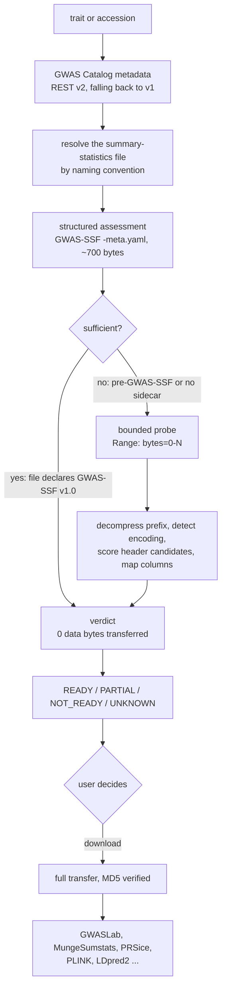

# Architecture

## The one decision GWASPoker makes



Everything else in the package exists to make that decision correct, cheap and
reproducible.

---

## Layers

Strictly one-directional: a lower layer never imports a higher one.

```text
  cli.py                    argument parsing, exit codes
      |
  reporting/                console, csv, json, html -- all formatting
      |
  catalog/discovery.py      orchestration: the flowchart above
      |
  +---------+---------+---------+----------+-------------+
  |         |         |         |          |             |
catalog/  probe/   mapping/  readiness/  download/  processing/
  |         |         |         |          |             |
  +---------+---------+---------+----------+-------------+
      |
  http.py                   the only module that opens a socket
      |
  config.py  failures.py  provenance.py   cross-cutting
```

### Module responsibilities

| Module | Owns | Never does |
| --- | --- | --- |
| `http.py` | Sessions, retries, rate limiting, Range requests, bounded streaming | Parse anything domain-specific |
| `catalog/models.py` | The normalized data model | Touch the network |
| `catalog/rest_api.py` | v2/v1/Solr adapters; JSON to model | Decide anything |
| `catalog/sumstats_api.py` | GWAS-SSF sidecars; the withdrawn API's status | Read data files |
| `catalog/discovery.py` | The metadata-first workflow | Format output |
| `metadata/` | Sample counts, ancestry, optional QA model | Network I/O beyond what it is given |
| `probe/` | Bytes to header: compression, encoding, header scoring | Know what a study is |
| `mapping/` | Raw names to canonical concepts | Judge PRS suitability |
| `readiness/` | Concepts to a verdict | Know where the columns came from |
| `download/` | File selection and full transfer | Interpret file contents |
| `processing/` | Extraction and declared normalization | Fetch anything |
| `integrations/` | Optional hand-offs | Be a hard dependency |
| `reporting/` | Every user-visible string | Compute anything |
| `benchmark/` | Manifests, metrics, the probe-size sweep | Write ground truth |

The separation that matters most: **networking and parsing never mix**.
`probe/header.py` takes a `list[str]` and returns a result — which is why it can
be tested exhaustively against fixtures with no network at all.

---

## Deviations from the requested layout

Three files were added; nothing was removed.

| File | Why |
| --- | --- |
| `failures.py` | Section 12 of the specification requires structured failure categories. Putting the vocabulary in one module keeps it importable from every layer without a cycle. |
| `http.py` | The specification requires bounded byte retrieval and forbids shell tools. Concentrating all socket access here is what makes "the parsing modules never see a `Response`" enforceable. |
| `provenance.py` | Section 23 requires reproducibility metadata on every benchmarkable operation. It is cross-cutting, so it does not belong under `reporting/`. |

`reporting/csv.py` and `reporting/json.py` shadow stdlib module names, but only
inside the `gwaspoker.reporting` package; both import their stdlib counterparts
normally because the package uses absolute imports throughout.

---

## Key design decisions

### 1. Bound on bytes, not on time

v1 ran `timeout -s KILL 10 wget -q <url>`. How much data that moved depended on
the network, so the experiment was not reproducible and the volume was
unbounded.

`--probe-bytes` is a byte ceiling. With Range support the server sends exactly
that many; without it, GWASPoker closes the connection at the limit itself. Both
paths record `requested_bytes`, `received_bytes`, `range_supported`,
`range_used` and `transfer_time_seconds`.

### 2. Incremental decompression

`zlib.decompressobj(wbits=31)` decodes as much of a gzip stream as the input
allows and stops, without complaining that the stream is incomplete. That single
fact is what makes probing a `.gz` possible. Zip and tar are handled by reading
their leading structures; bzip2 and xz cannot be decoded from a short prefix and
say so rather than guessing.

### 3. Header detection by scoring, not by assumption

Every line is a candidate. Each is scored on: fraction of fields that map to a
canonical concept; GWAS vocabulary hits; fraction of non-numeric cells; column
name uniqueness; field-count agreement with following rows; whether those rows
look like data; field-count plausibility; position; delimiter prior; penalties
for comment and `key=value` shapes.

Delimiter and header are chosen jointly, because a line's field count is
meaningless until a delimiter is fixed. Confidence combines the winner's
absolute score with its margin over the runner-up, so a near-tie is never
reported as certain.

### 4. Order is preserved everywhere

Headers are `tuple[str, ...]` from detection through mapping, reporting and
benchmarking. `set` is never used for header equality. v1's
`set(gwascols) - set(allcolumns)` discarded order and collapsed duplicates;
order matters to positional readers and to the *exact ordered header match*
metric.

### 5. `unknown` over a guess

A column no layer resolves is `unknown`, listed in `unidentified_columns`, and
counted in the benchmark's `unknown_rate`. A forced mapping is a scientific
error that propagates silently into a polygenic score; an `unknown` is a prompt
for a human to look.

### 6. Absence is never a plausible value

`None` in the model, dim `unknown` in the console, empty in CSV. Never `0`,
never `-`. v1's `extract_number` returned the integer `0` on any parse failure,
making an error indistinguishable from a real zero.

### 7. Data is never rewritten to please a parser

`processing/normalize.py` applies only declared, column-scoped, recorded
transformations. The blanket rewrites v1 performed
(`content.replace(':', '_').replace('\t', ',')`) are listed in
`UNSAFE_TRANSFORMATIONS` and reported as *declined*, so a reader can see what
was deliberately not done.

### 8. Optional dependencies stay optional

`transformers`, `torch`, `gwaslab` and `openpyxl` are imported inside the
functions that need them. `search`, `probe`, `assess` and `scan` work with the
six core dependencies. The QA pipeline is cached per process
(`functools.lru_cache`); v1 rebuilt a 335 M-parameter model three times per
study.

### 9. "Metadata-first", not "API-first"

The GWAS Catalog REST API answers questions about *studies*. It does not
describe a summary-statistics file's columns: the raw v1 study response has 19
keys and not one of them mentions harmonisation, file type or SSF status. The
Summary Statistics API that once served association records is withdrawn
(HTTP 410), and the Catalog states that API access to the full genome-wide
collection is being redeveloped.

So the structured route GWASPoker uses is the GWAS-SSF ``-meta.yaml`` sidecar --
a static file served over HTTP alongside the data, not an API. The code, the
CLI columns (`SSF Meta`, not `API`) and the manuscript all say so. The central
comparison is:

```text
GWAS-SSF structured metadata
    vs GWASPoker bounded raw-file probing
    vs complete-file retrieval and GWASLab
```

### 10. Provenance travels with results

Every JSON report carries GWASPoker version, Python version, platform,
timestamp, the GWAS Catalog data release and EFO version, the full
configuration, and per-operation facts: which endpoint answered, which file was
selected and why, bytes moved, latency, detected encoding, delimiter, header and
mapping, and the verdict.

---

## Data flow: `gwaspoker assess GCSTXXXXXXX --target prs`

```text
cli.assess
  -> DiscoveryService.assess
     1. GwasCatalogClient.get_study          v2, then v1     ~2 KB
     2. SummaryStatisticsResolver.resolve    FTP listing     ~2 KB
        - list top level, list harmonised/ if wanted
        - classify each entry, score, pick, record the reason
     3. SummaryStatisticsAssessor.assess
        - fetch <file>-meta.yaml                             ~0.7 KB
        - query the withdrawn API, record its 410            ~0.1 KB
        - sufficient iff file_type == "GWAS-SSF v1.0"
     4a. sufficient   -> assess_from_declared_fields         0 data bytes
     4b. insufficient -> RemoteProber.probe_url              <= probe_bytes
         - HEAD: size, Accept-Ranges
         - GET Range: bytes=0-N  (or bounded stream)
         - detect_compression -> decompress_prefix
         - detect_encoding    -> split_complete_lines
         - detect_header      -> ColumnMapper.map_header
         -> assess_from_mapping
     5. SampleSizeResolver: API -> regex -> optional LLM
  -> reporting.console.render_assessment
  -> reporting.{csv,json,html} if --output
  -> provenance.write if --provenance
```

Typical totals: about 5 KB for the structured route, or about 261 KB for the
probe route on a file of any size.

---

## Error handling

`failures.py` defines one `FailureCategory` enum used by every layer. Rules:

* no bare `except:`, no `except Exception: pass` — a test walks the AST;
* no `subprocess`, no `os.system` — the same test;
* a failure never returns a plausible-looking value;
* transient and permanent failures are distinct categories
  (`api_error` vs `api_deprecated` vs `not_represented`);
* non-fatal failures accumulate in a process-wide `FailureLog`, are summarised
  at the end of a run, and go to `--failure-log` as JSON Lines.

---

## Testing

| Suite | Count | Network |
| --- | --- | --- |
| Unit (`pytest`) | 378 | none — `responses` mocks every call |
| Integration (`pytest -m integration`) | 15 | live EBI |

Fixtures in `tests/fixtures/` are regenerated by `tests/fixtures/_generate.py`,
kept in the repository so the bytes are reviewable. Each targets a specific v1
failure mode: `#` preambles, `key=value` preambles, blank lines, 25-line
metadata blocks, Latin-1, a UTF-8 BOM, four delimiters, a truncated gzip, a zip
whose largest member is a PDF, and a headerless file.

Integration tests exist to detect upstream drift. They assert the *contract*
GWASPoker depends on — that Range requests are honoured, that the sidecar
parses, that the withdrawn API still answers 410 — not values the Catalog is
free to change.

---

## Extending

| To add | Change |
| --- | --- |
| A column alias | `mapping/aliases.yaml`, then `pytest tests/test_mapping.py` |
| A canonical concept | `aliases.yaml` plus a row in `MAPPING_SCHEMA.md` |
| A readiness target | A `(required, recommended)` tuple in `readiness/prs.py::TARGETS` |
| A compression format | A branch in `probe/compression.py::decompress_prefix` |
| An API route | A method on `catalog/rest_api.py`; nothing else changes |
| An output format | A module under `reporting/`; the domain layers are untouched |
| A benchmark metric | A function in `benchmark/metrics.py` plus a call in `evaluate.py` |
