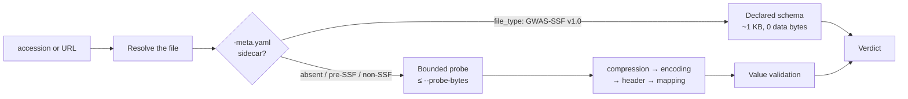

# Assess for PRS

```bash
gwaspoker assess GCST90271311 --target prs
```

This is the command the rest of the tool exists to support. It returns one of
three verdicts, with the evidence behind it.

---

## Two routes, one verdict



The report records which route produced the verdict in
`readiness_evidence_source`, so a downstream analysis can separate the two.

!!! success "The structured route costs no data bytes"

    For a 316 MB file with a GWAS-SSF sidecar, a complete verdict took **1,206
    bytes** — all of it metadata. The data file was never opened.

### Forcing the probe

```bash
gwaspoker assess GCST90271311 --force-probe --probe-bytes 262144
gwaspoker assess GCST90271311 --no-api
```

`--force-probe` reads bytes even when the sidecar would have answered. Useful
for confirming the two routes agree. `--no-api` disables the metadata route
entirely.

---

## Reading the verdict

<div class="grid cards" markdown>

- ### <span class="verdict-ready">READY</span>

    All five required fields are present, and the sampled values agree with the
    concepts the header claimed.

- ### <span class="verdict-conditional">CONDITIONAL</span>

    Usable once a stated condition is met — an odds ratio that must be
    log-transformed, a z-score that needs a sample size and a frequency to
    become an effect size.

- ### <span class="verdict-not-ready">NOT_READY</span>

    A required field is absent, or the values contradict the header.

</div>

A verdict is never a bare label. Every report names the column that satisfied
each requirement, the mapping method and confidence that produced it, and the
value-validation status that either confirmed or challenged it.

```text
PRS readiness: READY
Evidence: gwas_ssf_declaration

Required fields:
  ✓ variant identification <- variant_id
  ✓ effect allele          <- effect_allele
  ✓ other allele           <- other_allele
  ✓ effect size            <- beta
  ✓ p-value                <- p_value
```

See [PRS Readiness Rules](readiness.md) for what each requirement means and why
these five.

---

## Seeing the mapping

```bash
gwaspoker assess GCST90271311 --show-mapping
```

```text
 #  Column               Canonical concept        PRS   Method     Conf.  Values
 0  chromosome           chromosome               CHR   canonical   1.00   PASS
 1  base_pair_location   position                 BP    canonical   1.00   PASS
 2  effect_allele        effect_allele            A1    canonical   1.00   PASS
 3  other_allele         other_allele             A2    canonical   1.00   PASS
 4  beta                 beta                     BETA  canonical   1.00   PASS
 5  standard_error       standard_error           SE    canonical   1.00   PASS
 6  p_value              p_value                  P     canonical   1.00   PASS
```

The **Values** column is the second, independent line of evidence: it says
whether the numbers behave the way the concept requires. A `p_value` column
holding values above 1 shows `FAIL` here even though the name mapped at
confidence 1.00. See [Value Validation](validation.md).

---

## Harmonised versus raw files

```bash
gwaspoker assess GCST90271311 --harmonised yes   # prefer the harmonised file
gwaspoker assess GCST90271311 --harmonised no    # prefer the raw file
gwaspoker assess GCST90271311 --harmonised auto  # default
```

Harmonised files use the GWAS Catalog's `hm_`-prefixed column set and are
usually the safer choice for PRS: coordinates and alleles are aligned to a
single reference. `auto` prefers them when present.

!!! note "The `hm_` prefix is one rule, not 200 aliases"

    GWASPoker strips a leading `hm_` and re-runs the mapping, which covers the
    entire harmonised column set from a single heuristic.

---

## Output and provenance

```bash
gwaspoker assess GCST90271311 --format json --output verdict.json
gwaspoker assess GCST90271311 --format html --output verdict.html
gwaspoker assess GCST90271311 --provenance run.json
```

The provenance file records the GWASPoker version, Python version, platform,
timestamp, GWAS Catalog data release, EFO version, the full effective
configuration, and every per-operation fact — which endpoint answered, which
file was selected and why, bytes moved, latency, detected encoding, delimiter,
header, mapping and verdict.

---

## Next

- [PRS Readiness Rules](readiness.md) — the exact requirement definitions
- [Value Validation](validation.md) — the second evidence line
- [CLI Reference](cli-reference.md#assess) — every `assess` flag
