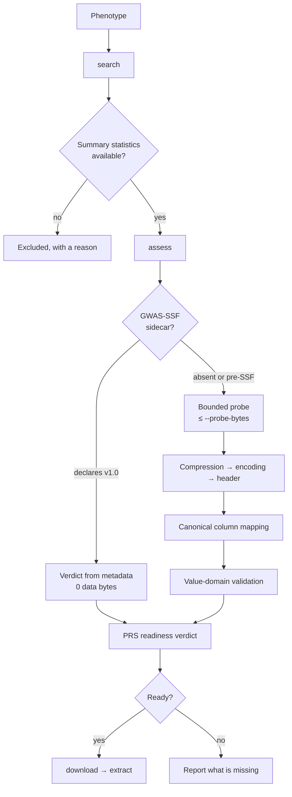

# GWASPoker

# Know before you download

**GWASPoker** decides whether a GWAS summary-statistics file is usable for a
polygenic risk score **before** the file is transferred. It reads structured
GWAS Catalog metadata first, and falls back to reading a bounded prefix of the
file only when metadata cannot answer the question.

A 377 MB file can be judged from 256 KB. A GWAS-SSF-declaring file can be judged
from **zero data bytes**.

<strong>99.94%</strong>
less data transferred across a controlled 50-file benchmark

<strong>0 bytes</strong>
of data read when a GWAS-SSF sidecar declares the schema

<strong>772/772</strong>
raw headers matching an independently observed source exactly

<strong>8</strong>
commands, from phenotype search to a normalized table

<strong>665</strong>
unit tests, plus 15 run against the live GWAS Catalog

---

## The one decision GWASPoker makes

Everything in this tool exists to answer a single question:

!!! question "Can these summary statistics produce PRS weights?"

    And if not — *what exactly is missing*, and *how confident is that answer*?

A PRS needs five things from a summary-statistics file: a variant identifier, an
effect allele, a non-effect allele, an effect size, and a p-value. Nothing else
is strictly required. GWASPoker's job is to find out whether those five columns
are present, whether their values behave the way those concepts should, and to
say so without downloading gigabytes to find out.

---

## Why not just download the file?

Because the answer is usually knowable from a few kilobytes, and often from
metadata alone.

=== "Structured route"

    The GWAS Catalog publishes a `-meta.yaml` sidecar beside many
    summary-statistics files. When it declares `file_type: GWAS-SSF v1.0`, the
    column schema is *fixed by the standard*. GWASPoker reads the sidecar,
    confirms the declaration, and reaches a verdict having read **no data bytes
    at all** — about 1.2 KB of metadata for a 316 MB file.

=== "Probe route"

    When no sidecar exists, or it declares `pre-GWAS-SSF` or `non-GWAS-SSF`,
    GWASPoker requests a bounded prefix — an HTTP `Range` request, or a stream
    it closes itself when the server ignores ranges. It decompresses that prefix
    incrementally, finds the header row, maps the columns, and validates a
    sample of values.

Both routes end at the same verdict, and the report records which one produced
it.

---

## Workflow

---

## What makes an answer trustworthy

GWASPoker separates two independent lines of evidence, and never lets one stand
in for the other.

| Evidence | Question it answers | Where it lives |
| --- | --- | --- |
| **Header mapping** | Does a column *say* it is a p-value? | [Column Mapping](mapping.md) |
| **Value validation** | Do its values *behave* like p-values? | [Value Validation](validation.md) |

A column named `P` whose values are all above 1 is reported as a conflict, not
as a p-value. A column named `SNP` holding row numbers is caught the same way.
This is why aliases that are merely *plausible* — `ID`, `ALT`, `REF` — map at
reduced confidence and wait for the values to confirm them.

---

## What GWASPoker does not do

Being explicit about scope is part of being trustworthy.

- **It does not compute a PRS.** It decides whether a file *could* feed one.
- **It does not rewrite your data to make it parse.** A file that needs
  repairing is reported as needing repair.
- **It does not guess.** An unresolved column is reported as `unknown` and
  listed, never forced onto a concept to improve a score.
- **It does not replace GWASLab, LDSC or PLINK.** The optional GWASLab
  hand-off exists so those tools receive a file already known to be usable.

---

## Where to go next

- :material-rocket-launch: **[Getting Started](getting-started.md)** — install
  it and reach a verdict in three commands.
- :material-magnify: **[Find Studies](search.md)** — search a phenotype and see
  which studies have usable files.
- :material-console: **[CLI Reference](cli-reference.md)** — every command,
  every flag.
- :material-sitemap: **[Architecture](architecture.md)** — how the layers fit
  together, and why.
- :material-chart-box: **[Validation Results](validation-results.md)** — four
  experiments over 2,208 GWAS Catalog studies and 402 external URLs.

---

## Citation

If GWASPoker contributes to published work, please cite the accompanying
manuscript. See [Reproducibility](reproducibility.md) for the version, data
release and provenance fields to report alongside your results.
