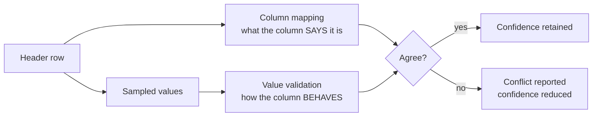

# Value Validation

A column named `P` is not a p-value. A column whose values all lie in `[0, 1]`,
skew toward zero, and never exceed 1 — that is a p-value.

Value validation is GWASPoker's **second, independent line of evidence**. It
runs between column mapping and readiness assessment, on rows the probe already
retained, and costs no extra network.

---

## Why a second line of evidence

Header names are evidence, but they are weak evidence in a field with no
enforced naming convention.



The two are kept structurally separate — `mapping` and `value_validation` are
distinct fields on the result — so they can be measured independently and
neither can quietly stand in for the other.

!!! danger "What this is not"

    Value validation is **not** a replacement for GWASLab, and GWASLab is never
    called by it. That independence is a requirement, not an accident: GWASLab
    serves as external ground truth in the [benchmark](benchmarking.md), and a
    predictor that consults its own grader measures nothing.

---

## The rules

Each canonical concept carries a domain. A column is checked against the domain
of the concept it was mapped to.

| Concept | Rule |
| --- | --- |
| `p_value` | `0 < p ≤ 1`. Exact zeros are allowed (underflow) but counted. |
| `neg_log10_p_value` | `≥ 0`, and not obviously a raw p-value in disguise. |
| `beta` | Finite, real. Extreme magnitudes are flagged, not rejected. |
| `odds_ratio` | `> 0`. A negative odds ratio is impossible. |
| `standard_error` | `> 0`. A zero or negative SE is impossible. |
| `effect_allele_frequency` | `0 ≤ f ≤ 1`. |
| `minor_allele_frequency` | `0 ≤ f ≤ 0.5` — by definition of *minor*. |
| `effect_allele`, `other_allele` | ACGT, indel notation, or a recognised symbol. |
| `chromosome` | `1`–`22`, `X`, `Y`, `MT`, with or without a `chr` prefix. |
| `position` | Positive integer within a plausible chromosome length. |
| `sample_size` | Positive integer. |
| `info_score` | `0 ≤ r² ≤ 1`, tolerating slight overshoot from imputation software. |
| `z_score` | Finite, real; extreme magnitudes flagged. |

---

## Cross-column checks

Some errors are only visible between columns:

- **Effect allele equals other allele** on the same row — the file cannot mean
  what it says.
- **`beta` and `odds_ratio` both present and inconsistent** — `beta ≈ ln(OR)`
  should hold.
- **`effect_allele_frequency` mapped from a column that is really a MAF** —
  caught when values never exceed 0.5 across a large sample.
- **`p_value` inconsistent with `beta / standard_error`** — the implied z-score
  and the reported p disagree.

---

## Statuses

| Status | Meaning | Threshold |
| --- | --- | --- |
| **PASS** | The values behave as the concept requires. | ≥ 95% of sampled values in domain |
| **WARN** | Mostly right, with a minority that is not. | 80–95% |
| **FAIL** | The values contradict the concept. | < 80% |
| **NOT_TESTED** | Nothing was sampled — the probe retained no data rows. | — |

`NOT_TESTED` is deliberately distinct from `PASS`. A file whose values were
never checked has not passed anything.

---

## How it feeds readiness

Validation does not veto a mapping; it **scales the confidence** attached to it.

| Value status | Confidence factor |
| --- | --- |
| PASS | 1.00 |
| WARN | 0.85 |
| FAIL | 0.40 |
| NOT_TESTED | 1.00 |

A `FAIL` on a required field drags the requirement's confidence low enough to
change the verdict, and the report says why. `NOT_TESTED` leaves confidence
untouched — absence of evidence is not evidence of a problem.

!!! example "The case this exists for"

    A column called `P` holding values between 0 and 300. Header mapping says
    `p_value` at confidence 0.95. Value validation says `FAIL`: 0% of sampled
    values are within `(0, 1]`. The report shows both, and the verdict reflects
    the conflict rather than the name.

---

## Sampling

Validation reads rows the probe already retained — typically 50 or more from a
default probe. Sampling is capped so a large probe does not make validation
slow, and the report states how many rows were used:

```text
Value validation: PASS over 50 sampled row(s) (of 50 retained by the probe).
```

Raise `--probe-bytes` to validate more rows.

---

## Next

- [Column Mapping](mapping.md) — the first evidence line
- [PRS Readiness Rules](readiness.md) — how both feed the verdict
